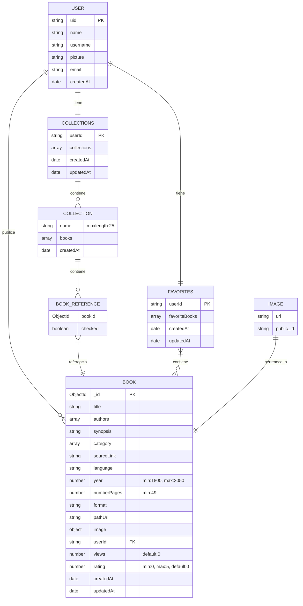

# XBuniverse API RESTful

Esta interfaz permite a los usuarios gestionar una colección de libros mediante una serie de rutas (endpoints). Los usuarios pueden realizar operaciones CRUD (Crear, Leer, Actualizar, Eliminar) sobre los recursos de libros, así como buscar libros por varios criterios. Está diseñada para ser utilizada por aplicaciones front-end, aplicaciones móviles o cualquier otro cliente que necesite acceder.

## Características

* **Crear libros**: Permite añadir nuevos libros.
* **Obtener libros**: Recupera una lista de libros o un libro específico por su ID.
* **Actualizar libros**: Permite modificar la información de un libro existente.
* **Eliminar libros**: Eliminar un libro.
* **Buscar libros**: Ofrece capacidades de búsqueda y filtrado por título, autor, categoria/género, año de publicación.
* **Agregar libros a favoritos**: Permite marcar libros como favoritos para un acceso rápido.
* **Crear colecciones de libros**: Permite organizar libros en colecciones personalizadas según las preferencias del usuario.

## Arquitectura de la API

## Diagrama de base de datos

## Esquema de la API

### Rutas de libros

| Ruta | Método | Descripción |
| --- | --- | --- |
| `/books` | GET | Recupera una lista de libros. |
| `/books/:id` | GET | Recupera un libro específico por su ID. |
| `/books` | POST | Crea un nuevo libro. |
| `/books/:id` | PATCH | Actualiza la información de un libro existente. |
| `/books/:id` | DELETE | Elimina un libro. |
| `/books/search` | GET | Busca libros por título y autor. |
| `/books/options` | GET | Recupera una lista de opciones de filtrado para la búsqueda de libros. |
| `/books/more-books/:id` | GET | Recupera un libro aleatorio de una colección de libros. |
| `/books/related-books/:id` | GET | Recupera un libro relacionado con otro libro. |
| `/books/more-books-authors/:id` | GET | Recupera un libro aleatorio de un autor específico. |
| `/books/most-viewed-books` | GET | Recupera un lista de libros más vistos. |
| `/books/path/:pathUrl` | GET | Recupera un libro por su URL de ruta (slug). |

### Rutas de usuarios

| Ruta | Método | Descripción |
| --- | --- | --- |
| `/users` | GET | Recupera una lista de usuarios. |
| `/users/check-user/:userId` | GET | Verifica si un usuario existe. |
| `/users/:userId/:username/books` | GET | Recupera una lista de libros de un usuario. |
| `/users/:userId` | DELETE | Elimina la cuenta del usuario. |
| `/users/favorites/:userId` | GET | Recupera una lista de libros favoritos de un usuario. |
| `/users/favorites` | PATCH | Agrega o elimina un libro en favoritos. |
| `/users/favorites/:userId` | DELETE | Elimina todos los favoritos. |
| `/users/collections/:userId` | GET | Recupera una lista de colecciones de un usuario. |
| `/users/:userId/collections/summary/:bookId` | GET | Recupera una lista de libros de una colección de un usuario. |
| `/users/collections/:userId` | POST | Crea una nueva colección de un usuario. |
| `/users/collections/:userId/collection/:collectionId` | DELETE | Elimina una colección de un usuario. |
| `/users/collections/:userId` | DELETE | Elimina todas las colecciones de un usuario. |
| `/users/collections/collection/:collectionId` | GET | Recupera una colección de un usuario. |
| `/users/collections/books/toggle` | PATCH | Agrega o elimina un libro de una colección. |
| `/users/collections/:collectionId` | PATCH | Actualiza el nombre de una colección. |
| `/users/collections/remove` | PATCH | Elimina un libro de una colección. |

2025 Franco Andrés Sánchez
