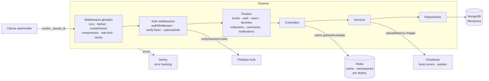
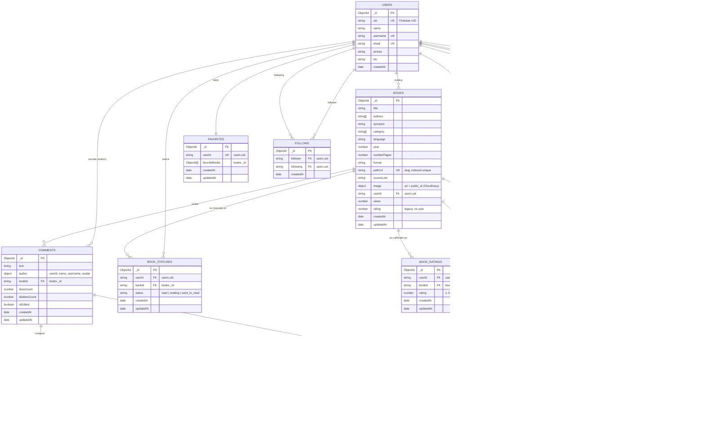

# XBuReads API RESTful

Esta interfaz permite a los usuarios gestionar una colección de libros mediante una serie de rutas (endpoints). Los usuarios pueden realizar operaciones CRUD (Crear, Leer, Actualizar, Eliminar) sobre los recursos de libros, así como buscar libros por varios criterios. Está diseñada para ser utilizada por aplicaciones front-end, aplicaciones móviles o cualquier otro cliente que necesite acceder.

## Características

* **Crear libros**: Permite añadir nuevos libros.
* **Obtener libros**: Recupera una lista de libros o un libro específico por su ID.
* **Actualizar libros**: Permite modificar la información de un libro existente.
* **Eliminar libros**: Eliminar un libro.
* **Buscar libros**: Ofrece capacidades de búsqueda y filtrado por título, autor, categoría/género y año de publicación.
* **Favoritos**: Permite marcar libros como favoritos para un acceso rápido.
* **Colecciones**: Permite organizar libros en colecciones personalizadas según las preferencias del usuario.
* **Estado de lectura (reading status)**: Cada usuario puede marcar un libro como `read`, `reading` o `want_to_read`.
* **Sistema de comentarios**: Permite a los usuarios dejar comentarios en cada libro, con la posibilidad de editarlos, eliminarlos y gestionar reacciones (likes/dislikes).
* **Rating de libros**: Cada usuario puede calificar un libro con un voto del 1 al 5. La API agrega el promedio y la cantidad total de votos.
* **Sistema de seguimiento**: Permite a los usuarios seguir y dejar de seguir a otros usuarios, con acceso a la lista de seguidores, seguidos y estadísticas de ambos conteos.
* **Feed de actividad social**: Genera un feed paginado y cronológico para el usuario autenticado, combinando libros publicados, comentarios, ratings, cambios de reading status, follows y eventos de favoritos/colecciones de los usuarios que sigue (y los del propio usuario). Las actividades del mismo usuario sobre el mismo libro en un mismo día se agrupan en una sola entrada.
* **Notificaciones in-app**: El usuario recibe notificaciones por follows, comentarios en sus libros, calificaciones recibidas y reacciones (like/dislike) sobre sus comentarios. Soporta marcar como leídas, marcar como no leídas, eliminar y obtener el conteo de no leídas para el badge.
* **Perfil editable**: El usuario puede actualizar su `name`, `username` y `bio`, y subir/reemplazar su avatar a Cloudinary.
* **Sitemap dinámico**: Endpoint `/sitemap.xml` con cache que enumera todas las páginas públicas para SEO.
* **Cacheo con Redis**: Endpoints de lectura frecuentes cacheados con TTL e invalidación selectiva. Las cache keys llevan un namespace por commit (`RENDER_GIT_COMMIT`) — cada deploy invalida automáticamente las entradas viejas, evitando servir respuestas con formato obsoleto.
* **Autenticación con Firebase**: Sesión basada en cookie firmada por Firebase Admin (14 días), validación local sin round-trip por request.

## Arquitectura de la API

```mermaid
flowchart LR
    Client[Cliente web/mobile]

    subgraph Express[Express]
        MW[Middlewares globales<br/>cors · helmet · cookieParser<br/>compression · rate-limit · sentry]
        Auth[Auth middlewares<br/>authMiddleware · verifyToken · optionalAuth]
        Routes[Routers<br/>books · auth · users · favorites<br/>collections · comments · notifications]
        Controllers[Controllers]
        Services[Services]
        Repos[Repositories]
    end

    Mongo[(MongoDB<br/>Mongoose)]
    Redis[(Redis<br/>cache · namespaced<br/>por deploy)]
    Firebase[Firebase Auth]
    Cloudinary[Cloudinary<br/>book covers · avatars]
    Sentry[Sentry<br/>error tracking]

    Client -->|cookie _secure_tk| MW
    MW --> Auth
    Auth --> Routes
    Routes --> Controllers
    Controllers --> Services
    Services --> Repos
    Repos --> Mongo
    Controllers -->|cache get/set/invalidate| Redis
    Auth -->|verifySessionCookie| Firebase
    Services -->|upload/destroy images| Cloudinary
    Express -->|errors| Sentry
```

## Diagrama de base de datos

```mermaid
erDiagram
    USERS ||--o{ BOOKS : publica
    USERS ||--|| COLLECTIONS : tiene
    USERS ||--|| FAVORITES : tiene
    USERS ||--o{ COMMENTS : "escribe (author)"
    USERS ||--o{ FOLLOWS : "follower"
    USERS ||--o{ FOLLOWS : "following"
    USERS ||--o{ BOOK_STATUSES : marca
    USERS ||--o{ BOOK_RATINGS : "vota (userId)"
    USERS ||--o{ ACTIVITY_LOG : genera
    USERS ||--o{ NOTIFICATIONS : "destinatario (userId)"
    USERS ||--o{ NOTIFICATIONS : "actor (actorId)"
    BOOKS ||--o{ COMMENTS : recibe
    BOOKS ||--o{ BOOK_STATUSES : "es marcado en"
    BOOKS ||--o{ BOOK_RATINGS : "es calificado en"
    BOOKS ||--o{ ACTIVITY_LOG : referencia
    BOOKS ||--o{ NOTIFICATIONS : referencia
    COLLECTIONS ||--o{ COLLECTION_ITEM : contiene
    COLLECTION_ITEM ||--o{ COLLECTION_BOOK : contiene
    COMMENTS ||--o{ REACTION : contiene
    COMMENTS ||--o{ NOTIFICATIONS : referencia

    USERS {
        ObjectId _id PK
        string uid UK "Firebase UID"
        string name
        string username UK
        string email UK
        string picture
        string bio
        date createdAt
    }
    BOOKS {
        ObjectId _id PK
        string title
        string[] authors
        string synopsis
        string[] category
        string language
        number year
        number numberPages
        string format
        string pathUrl UK "slug, indexed unique"
        string sourceLink
        object image "url + public_id (Cloudinary)"
        string userId FK "users.uid"
        number views
        number rating "legacy, no usar"
        date createdAt
        date updatedAt
    }
    BOOK_RATINGS {
        ObjectId _id PK
        string userId FK "users.uid"
        string bookId FK "books._id"
        number rating "1..5"
        date createdAt
        date updatedAt
    }
    FOLLOWS {
        ObjectId _id PK
        string follower FK "users.uid"
        string following FK "users.uid"
        date createdAt
    }
    FAVORITES {
        ObjectId _id PK
        string userId UK "users.uid"
        ObjectId[] favoriteBooks "books._id"
        date createdAt
        date updatedAt
    }
    COLLECTIONS {
        ObjectId _id PK
        string userId UK "users.uid"
    }
    COLLECTION_ITEM {
        ObjectId _id PK
        string name
        date createdAt
    }
    COLLECTION_BOOK {
        ObjectId bookId FK "books._id"
        boolean checked
    }
    COMMENTS {
        ObjectId _id PK
        string text
        object author "userId, name, username, avatar"
        string bookId FK "books._id"
        number likesCount
        number dislikesCount
        boolean isEdited
        date createdAt
        date updatedAt
    }
    REACTION {
        string userId FK "users.uid"
        string type "like | dislike"
    }
    BOOK_STATUSES {
        ObjectId _id PK
        string userId FK "users.uid"
        string bookId FK "books._id"
        string status "read | reading | want_to_read"
        date createdAt
        date updatedAt
    }
    ACTIVITY_LOG {
        ObjectId _id PK
        string userId FK "users.uid"
        string type "favorite | collection"
        string bookId FK "books._id"
        date createdAt
        date updatedAt
    }
    NOTIFICATIONS {
        ObjectId _id PK
        string userId FK "users.uid (destinatario)"
        string type "follow | comment | rating | reaction"
        string actorId FK "users.uid (quien generó)"
        string bookId FK "books._id (opcional)"
        string commentId FK "comments._id (opcional)"
        number rating "1..5 (solo type=rating)"
        string reactionType "like | dislike (solo type=reaction)"
        boolean read
        date createdAt
    }
```

## Esquema de la API

> **Nota sobre la columna "Protegido"**: las rutas montadas bajo `/api/users`, `/api/users/favorites` y `/api/users/collections` pasan por `authMiddleware` global — todas requieren cookie de sesión. Las que además llevan `verifyToken` validan que el `userId` del path coincida con el del token.

### Rutas de autenticación (`/api/auth`)

| Ruta | Método | Protegido | Descripción |
| --- | --- | --- | --- |
| `/auth/login` | POST | No | Inicia sesión con `idToken` de Firebase. Emite cookie `_secure_tk` (sesión de 14 días). |
| `/auth/register` | POST | Sí | Registra un usuario (asigna username). |
| `/auth/logout` | POST | Sí | Revoca refresh tokens y limpia la cookie. |
| `/auth/refresh` | POST | No | Renueva la session cookie con un `idToken` fresco. |

### Rutas de libros (`/api`)

| Ruta | Método | Protegido | Descripción |
| --- | --- | --- | --- |
| `/books` | GET | No | Lista paginada de libros (cacheada). |
| `/books/:id` | GET | No | Recupera un libro por ID. |
| `/books` | POST | Sí | Crea un nuevo libro. Invalida cache de libros. |
| `/books/:id` | PATCH | Sí | Actualiza un libro. Invalida cache de libros. |
| `/books/:id` | DELETE | Sí | Elimina un libro. Invalida cache de libros. |
| `/books/search` | GET | No | Busca libros por título y autor. |
| `/books/options` | GET | No | Opciones de filtrado (categorías, idiomas, años). Cacheada 1 h. |
| `/books/more-books/:id` | GET | No | Recupera libros aleatorios. |
| `/books/related-books/:id` | GET | No | Libros relacionados por categoría. Cacheada 30 min. |
| `/books/more-books-authors/:id` | GET | No | Más libros del mismo autor. Cacheada 30 min. |
| `/books/most-viewed-books` | GET | No | Libros más vistos. Cacheada 10 min. |
| `/books/path/:pathUrl` | GET | Opcional¹ | Recupera un libro por su slug. Cacheada 5 min per-user. Incrementa `views`. |
| `/books/:id/rating` | GET | Sí | Rating del libro asignado por el usuario actual. |
| `/books/:id/rating` | PUT | Sí | Crea/actualiza el rating (1..5) del usuario actual. Dispara notificación al autor del libro. |
| `/books/:id/rating` | DELETE | Sí | Elimina el rating del usuario actual. |
| `/books/:id/rating/stats` | GET | No | Promedio y cantidad de votos del libro. |

¹ Usa `optionalAuth`: funciona sin cookie pero, si hay sesión, personaliza la respuesta (`isFavorite`).

### Rutas de usuarios (`/api/users`, todas con `authMiddleware`)

| Ruta | Método | `verifyToken` | Descripción |
| --- | --- | --- | --- |
| `/users` | GET | No | Lista de usuarios. |
| `/users/me` | GET | Sí | Datos del usuario autenticado. Cacheada 5 min per-user. |
| `/users/me` | PATCH | Sí | Actualiza nombre, username, bio. Acepta multipart con `image` (avatar). Sube/reemplaza imagen en Cloudinary. |
| `/users/check-username` | GET | Sí | Verifica si un `username` está disponible (formato, reservado, ocupado). |
| `/users/me/feed` | GET | Sí | Feed paginado cronológico: libros, comentarios, ratings, reading status, follows y eventos de favoritos/colecciones. Las actividades del mismo (user + libro + día) se agrupan en `type: 'group'`. |
| `/users/me/book-status/:bookId` | GET | Sí | Estado de lectura del usuario para un libro. |
| `/users/me/book-status` | GET | Sí | Lista paginada de libros del usuario filtrados por estado (`status` query). |
| `/users/me/book-status/:bookId` | PATCH | Sí | Setea/actualiza el estado (`read` \| `reading` \| `want_to_read`). |
| `/users/me/book-status/:bookId` | DELETE | Sí | Elimina el estado de lectura. |
| `/users/profile/:username/books` | GET | No | Perfil público + libros + `followersCount`, `followingCount`, `isFollowing`, `readCount`, `commentsCount`, `topCategories`, `booksStats` (total views, rating promedio, libro más visto). |
| `/users/:userId/:username/books` | GET | Sí | Libros de un usuario. |
| `/users/:userId` | DELETE | Sí | Elimina la cuenta y limpia todos sus datos relacionados. |

### Rutas de seguimiento (`/api/users`)

| Ruta | Método | `verifyToken` | Descripción |
| --- | --- | --- | --- |
| `/users/follow/:targetUserId` | POST | Sí | Sigue a un usuario. Invalida `follow-stats` cache. Dispara notificación al destinatario. |
| `/users/follow/:targetUserId` | DELETE | Sí | Deja de seguir. Invalida `follow-stats` cache. Elimina la notificación previa. |
| `/users/:userId/followers` | GET | No | Lista de seguidores. |
| `/users/:userId/following` | GET | No | Lista de seguidos. |
| `/users/:userId/follow-stats` | GET | No | Estadísticas de seguimiento. Cacheada 5 min. |

### Rutas de favoritos (`/api/users/favorites`, todas con `authMiddleware`)

| Ruta | Método | Descripción |
| --- | --- | --- |
| `/:userId` | GET | Recupera libros favoritos paginados. |
| `/` | PATCH | Agrega o elimina un libro de favoritos. Invalida cache de detalle per-user. |
| `/:userId` | DELETE | Elimina todos los favoritos del usuario. |

### Rutas de colecciones (`/api/users/collections`, todas con `authMiddleware`)

| Ruta | Método | Descripción |
| --- | --- | --- |
| `/:userId` | GET | Lista de colecciones del usuario. |
| `/:userId` | POST | Crea una nueva colección. |
| `/:userId` | DELETE | Elimina todas las colecciones del usuario. |
| `/collection/:collectionId` | GET | Recupera una colección con sus libros. |
| `/collection/:collectionId` | PATCH | Actualiza el nombre de una colección. |
| `/:userId/collection/:collectionId` | DELETE | Elimina una colección puntual. |
| `/:userId/summary/:bookId` | GET | Colecciones del usuario que contienen un libro. |
| `/books/toggle` | PATCH | Agrega o quita libro de una colección. |
| `/remove` | PATCH | Elimina un libro de una colección. |

### Rutas de comentarios (`/api/users/comments`)

| Ruta | Método | Protegido | Descripción |
| --- | --- | --- | --- |
| `/book-comments/:bookId` | GET | No | Comentarios paginados de un libro. |
| `/user-comments/:userId` | GET | No | Comentarios escritos por un usuario. |
| `/comment/stats/:bookId` | GET | No | Estadísticas agregadas de comentarios de un libro. |
| `/comment` | POST | Sí | Crea un comentario. Dispara notificación al autor del libro. |
| `/comment/:commentId/:userId` | PATCH | Sí | Edita un comentario propio. |
| `/comment/:commentId/:userId` | DELETE | Sí | Elimina un comentario propio. |
| `/comment/:commentId/:userId/reaction` | POST | Sí | Agrega o togglea reacción (`like` / `dislike`). Dispara notificación al autor del comentario. |

### Rutas de notificaciones (`/api/notifications`, todas con `verifyToken`)

| Ruta | Método | Descripción |
| --- | --- | --- |
| `/` | GET | Lista paginada de notificaciones (más recientes primero). Cada item viene enriquecido con `actor` y `book` cuando aplica. |
| `/unread-count` | GET | Cantidad de notificaciones no leídas. Endpoint liviano pensado para polling (front lo consulta cada 30 s). |
| `/mark-all-read` | PATCH | Marca todas las notificaciones del usuario como leídas. |
| `/:notificationId/read` | PATCH | Marca una notificación como leída. |
| `/:notificationId/status` | PATCH | Cambia el estado de lectura (toggle, body `{ read: boolean }`). |
| `/:notificationId` | DELETE | Elimina una notificación. |

### Otros endpoints públicos

| Ruta | Método | Descripción |
| --- | --- | --- |
| `/health` | GET | Healthcheck. Devuelve `{ status: 'ok' }`. |
| `/sitemap.xml` | GET | Sitemap XML dinámico con todas las páginas públicas. Cacheado en Redis. |
| `/api-docs` | GET | Swagger UI con la documentación interactiva (solo en preview/dev). |

---

2026 Franco Andrés Sánchez
