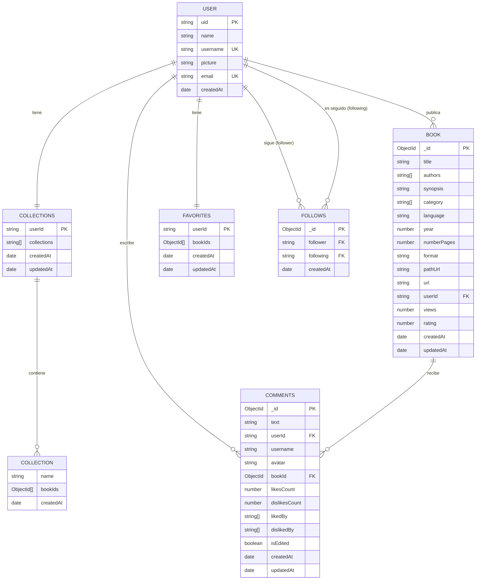

# XBuReads API RESTful

Esta interfaz permite a los usuarios gestionar una colección de libros mediante una serie de rutas (endpoints). Los usuarios pueden realizar operaciones CRUD (Crear, Leer, Actualizar, Eliminar) sobre los recursos de libros, así como buscar libros por varios criterios. Está diseñada para ser utilizada por aplicaciones front-end, aplicaciones móviles o cualquier otro cliente que necesite acceder.

## Características

* **Crear libros**: Permite añadir nuevos libros.
* **Obtener libros**: Recupera una lista de libros o un libro específico por su ID.
* **Actualizar libros**: Permite modificar la información de un libro existente.
* **Eliminar libros**: Eliminar un libro.
* **Buscar libros**: Ofrece capacidades de búsqueda y filtrado por título, autor, categoria/género, año de publicación.
* **Agregar libros a favoritos**: Permite marcar libros como favoritos para un acceso rápido.
* **Crear colecciones de libros**: Permite organizar libros en colecciones personalizadas según las preferencias del usuario.
* **Sistema de comentarios:** Permite a los usuarios dejar comentarios en cada libro, con la posibilidad de editarlos, eliminarlos y gestionar reacciones (likes/dislikes) tanto en comentarios propios como de otros usuarios.
* **Sistema de seguimiento**: Permite a los usuarios seguir y dejar de seguir a otros usuarios, con acceso a la lista de seguidores, seguidos y estadísticas de ambos conteos.
* **Feed de actividad social**: Genera un feed paginado y cronológico para el usuario autenticado, combinando libros publicados y comentarios de los usuarios que sigue.

## Arquitectura de la API

## Diagrama de base de datos

```mermaid
erDiagram
    USER ||--|| COLLECTIONS : tiene
    USER ||--o{ BOOK : publica
    USER ||--|| FAVORITES : tiene
    USER ||--o{ COMMENTS : escribe
    USER ||--o{ FOLLOWS : "sigue (follower)"
    USER ||--o{ FOLLOWS : "es seguido (following)"
    USER {
        string uid PK
        string name
        string username UK
        string picture
        string email UK
        date createdAt
    }
    FOLLOWS {
        ObjectId _id PK
        string follower FK
        string following FK
        date createdAt
    }
    BOOK ||--o{ COMMENTS : recibe
    BOOK {
        ObjectId _id PK
        string title
        string[] authors
        string synopsis
        string[] category
        string language
        number year
        number numberPages
        string format
        string pathUrl
        string url
        string userId FK
        number views
        number rating
        date createdAt
        date updatedAt
    }
    COLLECTIONS {
        string userId PK
        string[] collections
        date createdAt
        date updatedAt
    }
    COLLECTION {
        string name
        ObjectId[] bookIds
        date createdAt
    }
    COLLECTIONS ||--o{ COLLECTION : contiene
    FAVORITES {
        string userId PK
        ObjectId[] bookIds
        date createdAt
        date updatedAt
    }
    COMMENTS {
        ObjectId _id PK
        string text
        string userId FK
        string username
        string avatar
        ObjectId bookId FK
        number likesCount
        number dislikesCount
        string[] likedBy
        string[] dislikedBy
        boolean isEdited
        date createdAt
        date updatedAt
    }
```

## Esquema de la API

### Rutas de autenticación

| Ruta | Método | Protegido | Descripción |
| --- | --- | --- | --- |
| `/auth/login` | POST | No | Inicia sesión con idToken de Firebase. |
| `/auth/register` | POST | Sí | Registra un usuario (crea username). |
| `/auth/logout` | POST | Sí | Cierra sesión e invalida tokens. |
| `/auth/refresh` | POST | No | Renueva la sessionCookie. |

### Rutas de libros

| Ruta | Método | Protegido | Descripción |
| --- | --- | --- | --- |
| `/books` | GET | No | Recupera una lista de libros. |
| `/books/:id` | GET | No | Recupera un libro específico por su ID. |
| `/books` | POST | Sí | Crea un nuevo libro. |
| `/books/:id` | PATCH | Sí | Actualiza la información de un libro existente. |
| `/books/:id` | DELETE | Sí | Elimina un libro. |
| `/books/search` | GET | No | Busca libros por título y autor. |
| `/books/options` | GET | No | Recupera una lista de opciones de filtrado. |
| `/books/more-books/:id` | GET | No | Recupera un libro aleatorio de una colección. |
| `/books/related-books/:id` | GET | No | Recupera un libro relacionado con otro. |
| `/books/more-books-authors/:id` | GET | No | Recupera un libro aleatorio de un autor. |
| `/books/most-viewed-books` | GET | No | Recupera libros más vistos. |
| `/books/path/:pathUrl` | GET | No | Recupera un libro por su slug. |

### Rutas de usuarios

| Ruta | Método | Protegido | Descripción |
| --- | --- | --- | --- |
| `/users` | GET | No | Recupera una lista de usuarios. |
| `/users/me` | GET | Sí | Obtiene los datos del usuario autenticado. |
| `/users/me/feed` | GET | Sí | Recupera el feed de actividad (libros y comentarios de usuarios seguidos), paginado y ordenado cronológicamente. |
| `/users/profile/:username/books` | GET | No | Recupera libros y perfil de un usuario por su username, incluyendo `followersCount`, `followingCount` e `isFollowing`. |
| `/users/:userId/:username/books` | GET | Sí | Recupera libros de un usuario. |
| `/users/:userId` | DELETE | Sí | Elimina la cuenta del usuario. |

### Rutas de seguimiento

| Ruta | Método | Protegido | Descripción |
| --- | --- | --- | --- |
| `/users/follow/:targetUserId` | POST | Sí | Sigue a un usuario. |
| `/users/follow/:targetUserId` | DELETE | Sí | Deja de seguir a un usuario. |
| `/users/:userId/followers` | GET | No | Recupera la lista de seguidores de un usuario. |
| `/users/:userId/following` | GET | No | Recupera la lista de usuarios seguidos. |
| `/users/:userId/follow-stats` | GET | No | Recupera estadísticas de seguimiento (followers y following count). |

### Rutas de favoritos

| Ruta | Método | Protegido | Descripción |
| --- | --- | --- | --- |
| `/users/favorites/:userId` | GET | Sí | Recupera libros favoritos. |
| `/users/favorites` | PATCH | Sí | Agrega o elimina un libro en favoritos. |
| `/users/favorites/:userId` | DELETE | Sí | Elimina todos los favoritos. |

### Rutas de colecciones

| Ruta | Método | Protegido | Descripción |
| --- | --- | --- | --- |
| `/users/collections/:userId` | GET | Sí | Recupera colecciones de un usuario. |
| `/users/:userId/collections/summary/:bookId` | GET | Sí | Recupera libros de una colección. |
| `/users/collections/:userId` | POST | Sí | Crea una nueva colección. |
| `/users/collections/:userId/collection/:collectionId` | DELETE | Sí | Elimina una colección. |
| `/users/collections/:userId` | DELETE | Sí | Elimina todas las colecciones. |
| `/users/collections/collection/:collectionId` | GET | Sí | Recupera una colección. |
| `/users/collections/books/toggle` | PATCH | Sí | Agrega o elimina libro de colección. |
| `/users/collections/:collectionId` | PATCH | Sí | Actualiza el nombre de una colección. |
| `/users/collections/remove` | PATCH | Sí | Elimina un libro de una colección. |

### Rutas de comentarios

| Ruta | Método | Protegido | Descripción |
| --- | --- | --- | --- |
| `/users/comments/:bookId` | GET | No | Recupera comentarios de un libro. |
| `/users/comments` | POST | Sí | Crea un comentario en un libro. |
| `/users/comments/:commentId` | PATCH | Sí | Edita un comentario. |
| `/users/comments/:commentId` | DELETE | Sí | Elimina un comentario. |

2025 Franco Andrés Sánchez
